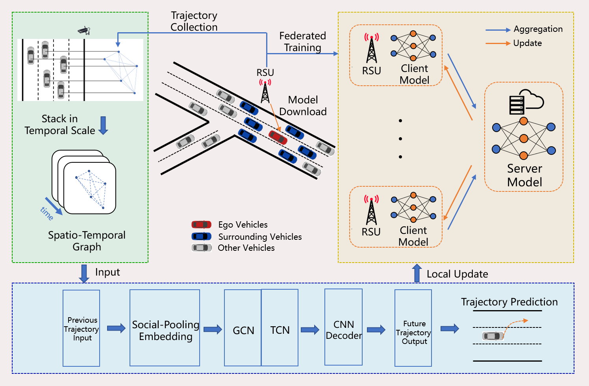
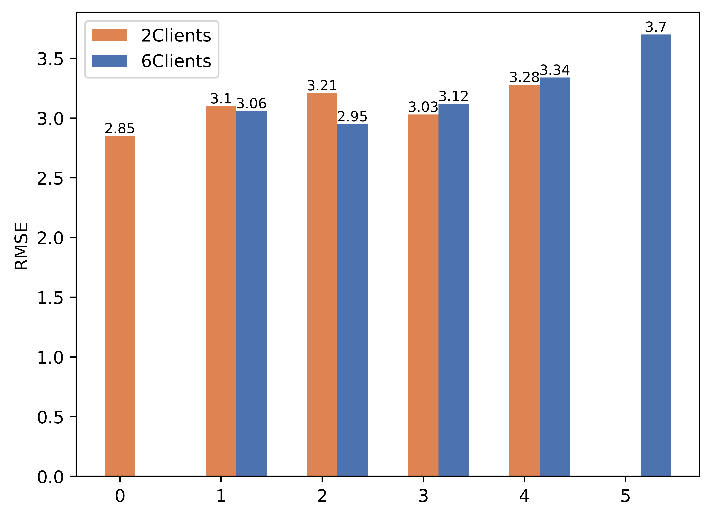
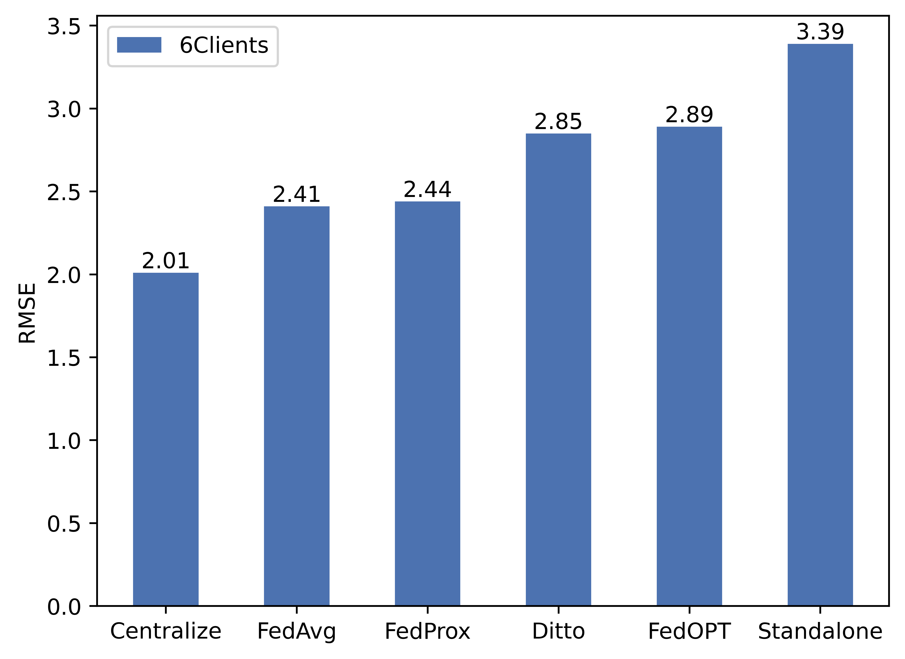
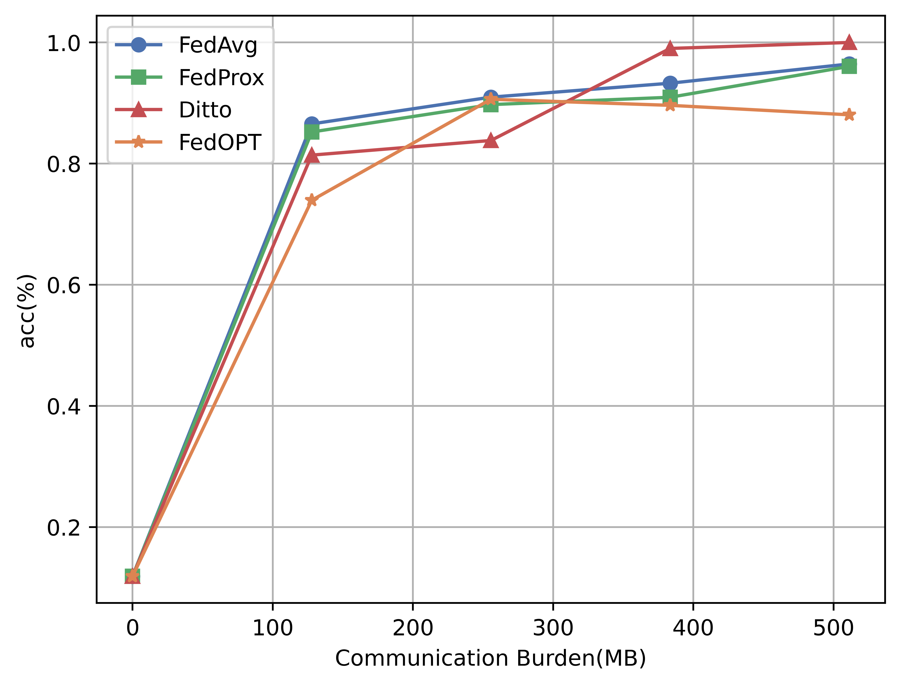
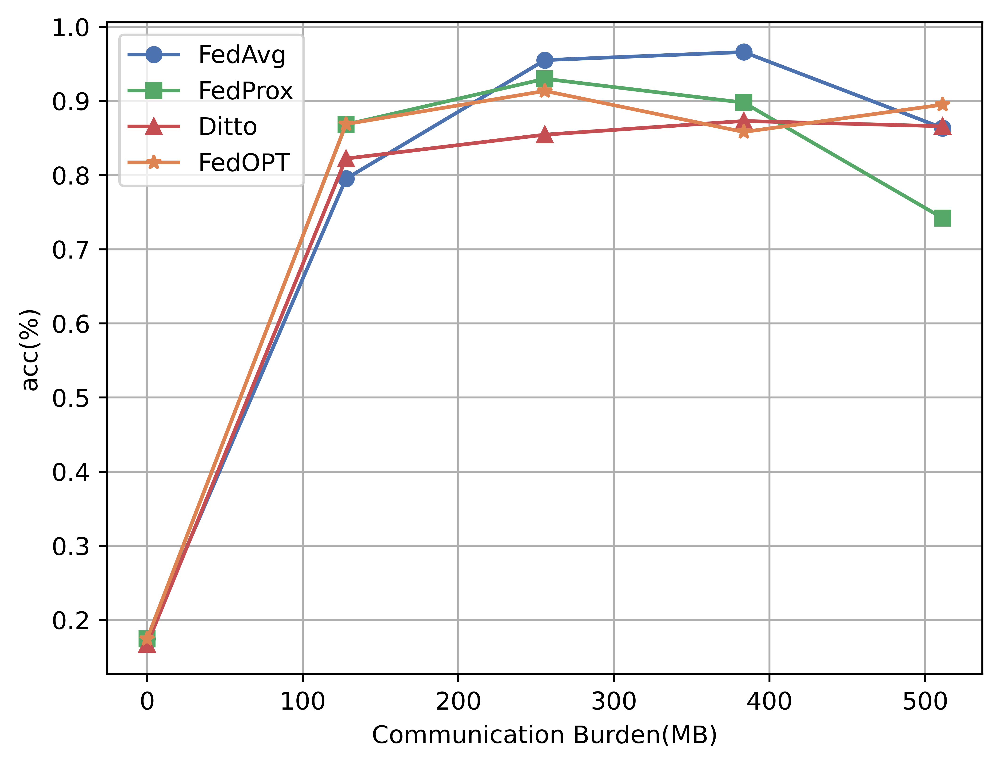

# FedVTP

## Abatract
Vehicle Trajectory Prediction (VTP) plays a pivotal role in the Internet of Vehicles (IoV), significantly aiding in motion planning and accident prevention. Nonetheless, the field faces challenges in distributed data collection and trajectory privacy protection. Existing approaches often incur substantial communication overheads and are not suited for contemporary road environments. Furthermore, there is a noticeable absence of a standardized benchmark. In response to these challenges, our paper introduces an innovative Federated Learning (FL) methodology for VTP. We leverage roadside units (RSUs) as the FL clients, rather than directly using vehicles. This strategy minimizes resource consumption and suits for the current scenario where trajectories are collected by RSUs. In addition, we present FedVTP, a comprehensive benchmark for federated spatial-temporal graph solutions in VTP. FedVTP integrates various strategies and eases for future expansions. We conduct extensive experiments to evaluate the effectiveness of our approach, with detailed analyses provided within FedVTP. This benchmark further encourages the development of new FL strategies for VTP, while enabling equitable comparisons among research works in the field.

## Installation
Install the required packages by following commands before training.
`conda env create -f environment.yml`
`conda activate fedvtp`

## Dataset
The NGSIM and HighD datasets can be downloaded from their official website. To start the experiment, use the tools in `/dataset` for data processing. 

## Running the experiments
`python system_trajectory/train.py -data NGSIM -m stgcn -go stgcn -algo FedAvg -nc 6 -ls 3 -jr 1 -lbs 128 -gr 1000 -stg 3 -txp 5`
`python system_trajectory/train.py -data HIGHD -m stgcn -go stgcn -algo FedAvg -nc 6 -ls 3 -jr 1 -lbs 128 -gr 1000 -stg 3 -txp 5`
Models will be saved at `/models` with the dataset name and training datetime.

## Result

